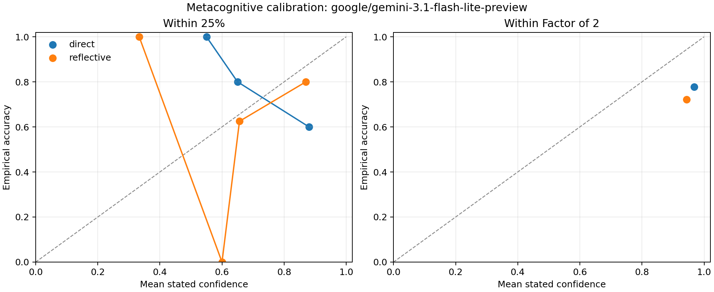

# Can This LLM Tell When It Might Be Wrong?

## Plain-Language Summary

AutoPsych is a project that uses psychology-style experiments to study how large language models behave. In this study, we tested one model, `google/gemini-3.1-flash-lite-preview`, on a simple but important question:

**When the model gives an answer, does it have a useful sense of how likely that answer is to be right?**

This is called **metacognition**. In everyday terms, metacognition means “thinking about your own thinking.” For a person, this might mean knowing when you are guessing, when you are confident, or when you should double-check your work. For an LLM, we cannot assume there is an inner feeling of confidence. We can only study what the model *does*: what confidence it reports, how accurate it is, and whether those two things line up.

The headline result is mixed:

- The model was often very accurate on these structured estimation problems.
- Its confidence was reasonably close to reality when asked whether its answer was within 25% of the truth.
- But it was **too confident** when asked whether its answer was within a factor of 2 of the truth.
- Asking it to briefly reflect before answering made it report lower confidence, but did not improve accuracy in this small study.

The practical implication is simple: this model can sometimes give useful confidence signals, but its confidence should not be treated as automatically trustworthy. AutoPsych exists to measure exactly this kind of gap between what a model says about itself and how it actually performs.

## What AutoPsych Is Doing Here

AutoPsych treats an LLM as the “subject” in an experiment. Instead of asking whether the model “really has” a human-like mind, AutoPsych asks a more measurable question:

**Does the model show stable, testable behavior that is similar to a psychological ability?**

For this study, the psychological ability is metacognition. In humans, metacognition helps us decide whether to trust an answer, revise it, ask for help, or admit uncertainty. In AI systems, a metacognition-like behavior would be valuable because users need to know when a model is likely to be right and when it is likely to be wrong.

This study focused on one narrow form of metacognition: **confidence calibration**.

## What “Confidence Calibration” Means

Confidence calibration means that confidence should match reality.

For example:

- If a model says it is 80% confident across many answers, then roughly 80% of those answers should be correct.
- If it says it is only 50% confident, then the answer should be much less reliable.
- If it says it is 95% confident, but it is right only 75% of the time, then it is overconfident.

This matters because a model can be good at solving problems but still poor at knowing when it is making mistakes. Those are different abilities.

## What We Tested

The model answered 36 estimation questions. Each question described a made-up but realistic scenario with enough information to calculate the correct answer.

Example task type:

> A hotel has a certain number of rooms, a given occupancy rate, and a typical amount of laundry per guest. Estimate annual laundry mass.

These were not trivia questions. They were designed so the model had to reason through quantities instead of recalling a fact from training data.

The study used 18 tasks. Each task was shown twice:

- Once in a **direct** condition.
- Once in a **reflective** condition.

## The Two Conditions

### Direct Condition

In the direct condition, the model was told:

> Answer directly. Give your best estimate and your confidence ratings without extra deliberation.

This condition measures how the model behaves when it gives a straightforward answer.

### Reflective Condition

In the reflective condition, the model was told:

> Before answering, silently consider two ways your estimate could be wrong. Then give your best estimate and confidence ratings.

This condition tests whether a small amount of prompted self-checking changes the model’s confidence or accuracy.

## What the Model Had to Report

For each task, the model returned a structured answer with:

- **Estimate:** its best numerical answer.
- **80% interval:** a lower and upper range where it thought the true answer would probably fall.
- **Confidence within 25%:** how likely it thought its estimate was to be close to the truth.
- **Confidence within 2x:** how likely it thought its estimate was to be within half to double the true answer.
- **Difficulty:** how hard it thought the task was.

These fields let us compare the model’s self-assessment with actual accuracy.

## How to Read the Main Measures

### “Within 25%”

This is a strict measure. If the true answer is 100, then an estimate from 80 to 125 counts as within 25%.

This asks: **Was the model very close?**

### “Within 2x”

This is a looser measure. If the true answer is 100, then anything from 50 to 200 counts as within a factor of 2.

This asks: **Was the model at least in the right general range?**

### “80% Interval Coverage”

The model gave a lower and upper bound for each answer. If it is well calibrated, then an “80% interval” should contain the true answer about 80% of the time.

This asks: **When the model gives an uncertainty range, is that range wide enough to reflect its real uncertainty?**

### “Median Factor Error”

This describes the typical size of the model’s error. A median factor error of 1.01x means the typical estimate was extremely close to the correct answer. Larger values mean larger typical errors.

This asks: **How far off was the model on a typical task?**

## Results

Overall, the model’s typical estimate was very close to the correct answer: its median factor error was **1.01x**.

That strong average performance is important, but it does not settle the metacognition question. The key issue is whether the model’s confidence matched its actual accuracy.

| Measure | What Happened | Plain-Language Meaning |
| --- | ---: | --- |
| Within 25% accuracy | 69.4% | The model was very close on about 7 out of 10 trials. |
| Mean confidence for being within 25% | 70.8% | Its confidence on this strict measure was close to reality. |
| Within 2x accuracy | 75.0% | The model was in the right broad range on 3 out of 4 trials. |
| Mean confidence for being within 2x | 95.6% | It acted almost certain it was broadly right, but it was not. |
| 80% interval coverage | 69.4% | Its uncertainty ranges were too narrow overall. |

## Results by Condition

| Condition | Number of Trials | Typical Error | Very Close Accuracy | Confidence in Being Very Close | Broadly Right Accuracy | Confidence in Being Broadly Right | 80% Range Coverage |
| --- | ---: | ---: | ---: | ---: | ---: | ---: | ---: |
| Direct | 18 | 1.01x | 72.2% | 76.1% | 77.8% | 96.8% | 72.2% |
| Reflective | 18 | 1.01x | 66.7% | 65.6% | 72.2% | 94.4% | 66.7% |

The reflection instruction lowered the model’s stated confidence. On the strict “within 25%” question, reflective confidence was about **10.6 percentage points lower** than direct confidence. However, reflection did not improve accuracy in this run.

In simple terms: **asking the model to reflect made it less confident, but not more correct.**

## Where the Model Made Its Biggest Mistakes

The largest errors are especially informative because they show where confidence can fail.

| Task | Condition | Model Estimate | True Answer | Error Size | Confidence Within 25% |
| --- | --- | ---: | ---: | ---: | ---: |
| grocery_receipts | reflective | 21,800 | 218 | 100.00x | 60% |
| grocery_receipts | direct | 21,800 | 218 | 100.00x | 85% |
| coffee_cups | direct | 76,900,000 | 7,660,000 | 10.04x | 85% |
| stadium_trash | reflective | 11,400,000 | 1,140,000 | 10.00x | 65% |
| clinic_gloves | reflective | 3,880,000 | 388,000 | 10.00x | 85% |

These errors appear to be mostly scale or unit mistakes. For example, the grocery receipt task was off by a factor of 100. The important metacognitive point is that the model sometimes reported moderate or high confidence even when it was badly wrong.

That is exactly why confidence has to be tested rather than assumed.

## Where the Model Was Most Accurate

The model also solved many tasks almost exactly.

| Task | Condition | Model Estimate | True Answer | Error Size | Confidence Within 25% |
| --- | --- | ---: | ---: | ---: | ---: |
| stadium_trash | direct | 1,140,000 | 1,140,000 | 1.00x | 65% |
| museum_steps | direct | 5,540,000,000 | 5,540,000,000 | 1.00x | 60% |
| warehouse_boxes | direct | 1,240,000 | 1,240,000 | 1.00x | 90% |
| warehouse_boxes | reflective | 1,240,000 | 1,240,000 | 1.00x | 85% |
| bus_fuel | direct | 610,000 | 610,000 | 1.00x | 65% |

This shows that the model was not simply bad at the tasks. It was often numerically strong. The more interesting result is that its confidence did not always separate correct answers from large mistakes.

## What This Means

This study suggests three main points.

First, **accuracy and self-knowledge are different things**. A model can calculate many answers correctly while still giving unreliable signals about when it might be wrong.

Second, **confidence can look convincing even when it is not fully calibrated**. The model’s confidence for being within a factor of 2 was especially inflated. It claimed about 96% confidence, but achieved only 75% accuracy on that standard.

Third, **simple reflection prompts are not a complete solution**. The reflective instruction made the model less confident, but did not make it more accurate in this small experiment. Lower confidence is not automatically better metacognition; useful metacognition requires confidence to track actual correctness.

## Why This Matters for Users

If an AI system gives an answer and says it is confident, users may be tempted to trust it. This study shows why that can be risky.

For tasks involving estimates, calculations, planning, or advice, users need more than fluent answers. They need to know whether the model can recognize uncertainty. A model that sounds confident while making a large unit error can be dangerous in practical settings.

AutoPsych helps by turning this concern into something measurable. Instead of asking “Does the model understand its uncertainty?” in a vague way, we can ask:

- How often is it right when it says it is confident?
- Does confidence drop when the task is harder?
- Do its uncertainty ranges contain the truth as often as they should?
- Does reflection improve accuracy, calibration, or both?
- Are mistakes random, or do they follow a recognizable pattern?

## What This Means for AutoPsych

This first study is best understood as a pilot demonstration. It shows how AutoPsych can turn a psychological idea, metacognition, into a testable behavioral measurement for an LLM.

The study also points toward better future experiments:

- Test more models, not just one.
- Use more tasks and repeat each task several times.
- Add harder problems where the model is less likely to be near-perfect.
- Compare verbal confidence with other possible uncertainty signals, such as answer consistency across repeated samples.
- Test whether confidence predicts useful behavior, such as deciding to abstain, revise an answer, or ask for more information.

## Limitations

This study should not be read as a final verdict on Gemini models or on LLM metacognition in general.

Important limits:

- Only one model was tested.
- There were only 36 trials.
- The tasks were structured arithmetic-style estimation problems.
- The model was explicitly prompted to report confidence, so the confidence values are generated text, not direct access to an inner mental state.
- The model ID is a preview model routed through OpenRouter, so future behavior may change.

## Bottom Line

`google/gemini-3.1-flash-lite-preview` performed well on many estimation tasks, but its confidence was not fully reliable. It was roughly calibrated for the stricter “within 25%” judgment, but overconfident about being within a broad factor-of-two range. Reflection reduced confidence without improving accuracy.

The main lesson is that **metacognition in LLMs has to be measured behaviorally**. We should not assume that a model’s confidence statements mean the same thing as human self-knowledge. AutoPsych provides a way to test when those statements are useful, when they are misleading, and how they vary across models and settings.
